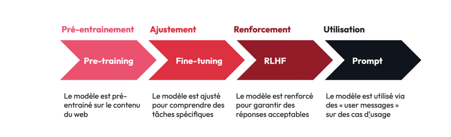
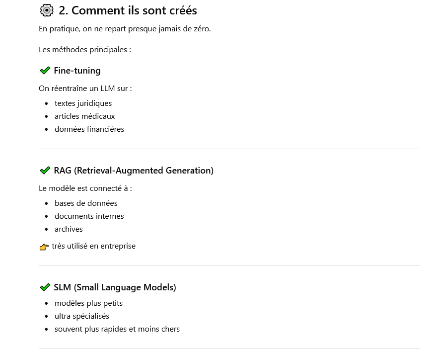
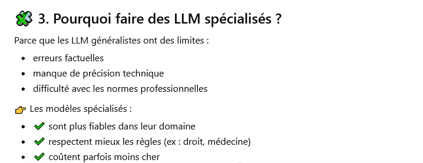
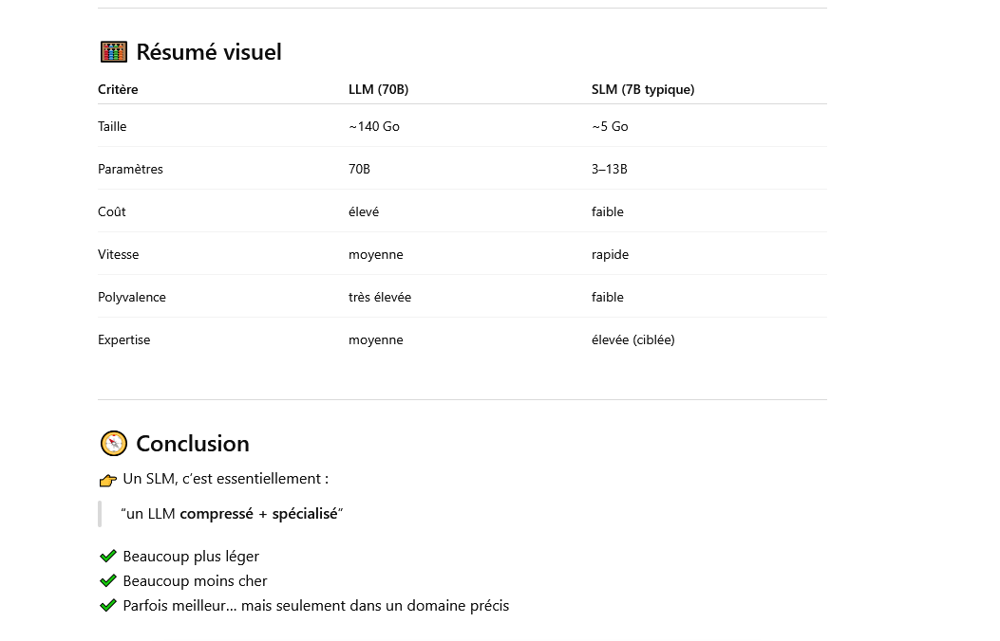

# Les LLM (Large langage models)

## Définition
  Un grand modèle de langage (Large Language Model, LLM) est un type de programme d'intelligence artificielle (IA) capable, entre autres tâches, de reconnaître et de générer du texte. 
  Large , en anglais grand , signifie que ce modèle est entrainé sur un nombre conséquent de données.

  Un LLM est un modèle qui a emmagasiné suffisament d'exemples pour être ensuite capable de reconnaitre une conversation et la poursuivre .

  Avant de se pencher sur le fonctionnement des LLm , un petit tour par l'hsitorique .

## Histoire des LLM

### Les débuts

  Plutôt que de parler d'histoire, on pourrait évoquer la préhistoire des LLM dès les années 50 avec l'apparition des n-grammes : A la données d'un mot , on associe un nombre (n ici) de mots . Par exemple , au mot CHAT , on peut associer le trigramme : NOIR, SOURIS, MANGE. Ce sont des mots que le modèle va mobiliser dès qu'on lui parle de CHAT.
  On se doute que le n doit être très grand pour qu'il y ait une efficacité quelconque mais que même dans ce cas, la fluidité de la conversation n'est pas assurée. Cette approche statistiques n'est pas viable pour "une conversation cohérente".

### Les Transformers , le tournant

!!! note "Définition : Token"

     __Token__ signifie jeton en anglais .Appliqué à l'IA ce mot signifie unité de données tratitée pour l'entrainement d'une IA

  La technologie autour des transformers ( le T de transformers est le même que celui de GPT ;) apparu en 2017 a permis l'essor des LLM 

  La plus value du __Transformer__ est énorme : Au lieu de traiter les mots un par un avec les techniques précédentes , on peut désormais considérer le texte  en sa totalité, facilitant la compréhension de l'ensemble et la cohérence de la sortie proposée.

  Depuis 2017, la technologie est restée la même mais  a considérablement évolué en terme de capacités de calculs:

       * Le modèle transformer est devenue plus efficace
       * L'accès aux données est devenue encore plus massive
       * La puissance de calculs a foirtement augmenté , notamment grâce à l'esssor des GPU
!!! note " Définition : GPU"
     Un GPU est un processeur graphique dont le but premier est la création d'images et de videos.
     Mais sa forte puissance de calcul en fait un allié formidable pour les IA .
     Cette technologie a fait la fortune de la société [Nvidia](https://www.nvidia.com/fr-fr/)

  Le premier modèle de LLm accessible au grand public est le fameux Chat GPT (3). S'il est révolutionnaire , il n'empêche qu'il présente pas mal de failles dans ses réponses (voir cours sur les __biais__).

  Aujourd'hui les enjeux et les axes d'amélioration des LLM sont multiples :

   * Amélioration des réponses
   * Modèles plus spécialisés
   * Aspect énergétique
   * Alignement éthique 
   * Augmenter la part d'open source (Mistral, Llama)

  

## Développement du modèle

Alors comment fonctionnent ces fameux LLM, eux qui semblent si humains quand on discute avec eux ?

On a vu plusieurs types d'apprentissage : __Supervisé, auto supervisé , non supervisé__ .

Les LLm sont construits sur le modèle de l'apprentissage auto supervisé : 

!!! note " Définition : Apprentissage auto supervisé"
    Les modèles travaillent avec des données non étiquetées : C'est le modèle qui va construire _sa vérité_ et non s'appuyer sur celles fournis par les programmeurs.

1. #### Le pré entrainement

Donc les LLM, à partir d'une immense quantité de données définissent "leur propre vérité. "
On obtient ainsi un modèle qui est près à "discuter" , ou plutôt à __prédire le mot suivant__ mais qui n'a pas été vérifié.

!!! tip "La technique "

    De façon sommaire , chaque texte à analyser est décomposé en __token__. A chaque token est associé sa position dans la phrase.
    C'est à ce moment qu'interviennent les __transformers__ (et les mathématiques ;))
    Au fur et à mesure de son apprentissage le modèle crée des relations entre les mots :

    Exemple : _L'homme se couvre car il a froid_
    Le modèle va comprendre que _il_ se rapporte à _l'homme_
    C'est ce que l'on appelle l'__auto attention__.
    Son but est de créer des relations pondérées entre tous les token
    On s'appuie sur trois _vecteurs_ : La requête, la clé , la valeur :

    >La requête représente ce qu’un token donné « recherche », la clé représente les informations que chaque token contient, et la valeur « renvoie » les informations de chaque vecteur clé, mise à l’échelle par son poids d’attention respectif.
    Les scores d’alignement sont ensuite calculés en fonction de la similarité entre les requêtes et les clés. 
    source : https://www.ibm.com/fr-fr/think/topics/large-language-models

2. #### Le fine tuning
  Ici, on va dire que le modèle possède la technique mais ne sait pas l'utiliser : Il va être entrainé sur des 'tonnes" d'exemples , il apprend à distinguer les différentes taches : coder, traduire , résumer , répondre aux questions...

3. #### L'alignement

C'est ici que l'humain intervient de façon prépondérante : Il va indiquer aux modèles ses erreurs , ce qu'il attend de lui...L'idée est de le rendre plus sur, plus pertinent et d'éliminer le plus possible biais et hallucinations.
On parle de __RLHF__ (Reinforcement Learning from Human Feedback), technique associée à l'apprentissage par renforcement.

Est également utilisé le __RAG__ (Retrieval-Augmented Generation) , technique qui permet de connecter le modèle à des bases de données actualisées: On peut ainsi enrichir le modèle sans pour autant le re-entrainer , diminuant ainsi coût et impact écologique .

[https://www.followtribes.io/performances-llm-puissance-gpu-parametres-dataset/](https://www.followtribes.io/performances-llm-puissance-gpu-parametres-dataset/)

Un excellent article développant les notions effleurées ci dessus

[site IBM](https://www.ibm.com/fr-fr/think/topics/transformer-model)

Et une video récapitulative:

## Taille des modèles 

On imagine bien que pour être très performant, un modèle devra avoir ingurgité une quantité phénomènale de données .

La puissance d'un __llm__ dépend de trois facteurs :
 
 * La quantité de data pour l'entrainement
 * Le nombre de paramètres qu'il intégre
 * La puissance de calcul des GPU utilisés

Bien évidemment, le principal souci est d'ordre écologique, ces modèles consommant beaucoup et nécessitant d'être refroidis (conso d'eau non négligeable , voir le cours sur [l'IA et l'écologie](impact_ecologie_IA.md) )

Les tailles des modèles vont de quelques millions de paramètres à plusieurs milliards.

Une tendance actuelle consiste , à partir des Llm , à créer des SLM (small langage model) spécialisés

Par exemple, à partir d'un LLM généraliste , on peut entrainer un sous modèle sur un thême précis , mettons le domaine juridique .

Et voici ce qu'il ressort avec chat gpt à partir du prompt :

>Existe il des sml spécialisés dans certains domaines  créés à partir de llm ?

!!! success "Réponse d'un LLM :"

    
    
    

Et en conclusion :

!!! success "Comparaison des modèles "
    

    _Remarque 70B_  c'est 70 billions en anglais soit 70 milliards  de paramètres.

## Sources 

Pour construire cette page , je me suis appuyé sur deux excellents sites : 

Celui [d'IBM](https://www.ibm.com/fr-fr/think/artificial-intelligence), très pointu et très complet  dans son approche de l'IA.

Le site de [Stephane Robert](https://blog.stephane-robert.info/docs/developper/programmation/python/llm/) est aussi une mine pédagogique .

Il existe quantité d'ouvrages sur l'IA, tous présentant le défaut d'être quasi obsolète avant de sortir . Pour autant, __L'intelligence artificielle pour les nuls__ a l'avantage de sprésenter des notions 'intemporelles' si l'on peut dire, de façon claire, concise et précise . C'est déjà beaucoup.

Enfin, en adepte de la récursivité , je me suis appuyé sur deux LLm  : [Chat GPT 4](https://chatgpt.com/)  et [Perplexity](https://www.perplexity.ai/), intégré au navigateur Comet.

_Last but nos least_, ce bon vieux [wikipedia](https://fr.wikipedia.org/wiki/Intelligence_artificielle) n'est jamais bien loin.
