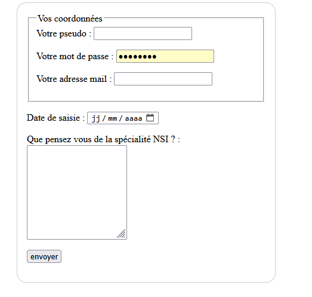

# Formulaire HTML - Balises Principales

## Structure de base

```html
<!DOCTYPE html>
<html lang="fr">
<head>
    <meta charset="UTF-8">
    <title>Mon Formulaire</title>
</head>
<body>
    <h1>Formulaire de Contact</h1>
    
    <form action="/traiter" method="POST">
        <!-- Champs du formulaire -->
    </form>
</body>
</html>
```

## Balises principales

| Balise | Description |
|--------|-------------|
| `<form>` | Conteneur du formulaire |
| `<input>` | Champ de saisie (texte, email, password, etc.) |
| `<textarea>` | Zone de texte multiligne |
| `<select>` | Liste déroulante |
| `<option>` | Option dans une liste |
| `<button>` | Bouton d'action |
| `<label>` | Étiquette pour un champ |
| `<fieldset>` | Groupe de champs |
| `<legend>` | Titre d'un groupe |

## Exemple complet

```html
<form action="/contact" method="POST">
    <label for="nom">Nom :</label>
    <input type="text" id="nom" name="nom" required>
    
    <label for="email">Email :</label>
    <input type="email" id="email" name="email" required>
    
    <label for="message">Message :</label>
    <textarea id="message" name="message" rows="5"></textarea>
    
    <button type="submit">Envoyer</button>
</form>
```
## Exercice 
A vous de reproduire la page ci dessous. Vous pouvez , et devez , améliorer la forme grace au fichier css que vous associerez à votre page html.


