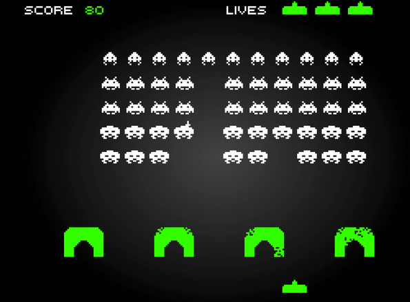

## SPACE INVADERS

apqrn5

Tu es prêt à coder ton premier jeu ? 

Un truc bien vintage , avec juste quelques couleurs, et un module de python qui va te faciliter la tache , Pyxel.

### Débuter

Voici [le lien](<https://github.com/kitao/pyxel/blob/main/docs/README.fr.md>)   pour une documentation complète du module pyxel

On y retrouve par exemple les couleurs possibles  et le numéro à utiliser pour les obtenir.

On va travailler en ligne sur le site https://www.pyxelstudio.net 

Une fois le site chargé:

 * Vous cliquez sur Create
 * Vous enregistrez  le lien qui vous est donné pour pouvoir retroucver votre travail
 * Vous allez coder dans la fenêtre de gauche , sous _import pyxel_
 * Et vous codez le jeu de space invaders :grin:
### Le début du jeu: Fixer la fenêtre et dessiner un vaisseau.

 Il y a dans notre progamme deux fonctions très importantes : draw et update ...la première dessine et la seconde met à jour .

 Donc , on fixe notre cadre, on place notre vaisseau dans le cadre en le dessinant (hyper basiquement, ne revez pas ! ), on le fait bouger et ...c'est déjà pas mal !

 Voici l'exemple 1 donné par la documentation: 

```py
import pyxel

pyxel.init(160, 120)      # on crée une fenêtre de 160 par 120

def update():
    if pyxel.btnp(pyxel.KEY_Q):   # appuyer sur la touche Q fait quitter 
        pyxel.quit()

def draw():
    pyxel.cls(0)   # on efface
    pyxel.rect(10, 10, 20, 20, 11) # on dessine un carré de coté 20 au point de coordonnées (10,10), couleur 11 soit vert clair.

pyxel.run(update, draw) # on met à jour , on dessine .

```

A l'aide cet exemple :

* Créer une fenêtre carrée de 128 de coté

* Créer deux variables vaisseau_x et vaisseau_y et leur affecter à chacune une abscisse et une ordonnée (entre 0 et 128 :grin:)

* Créer une fonction deplacement_vaisseau donc voici la documentation

```py
def deplacement_vaisseau (x,y):
    """ Cette fonction permet de dpélacer la position du vaisseau:
    On utilisera la touche gauche (KEY_LEFT) pour aller vers la gauche, et les touches KEY_RIGHT, KEY_UP,KEY_DOWN pour les autres déplacements.
    On utilisera btn au lieu de btnp de l'exemple
    ATTENTION : l'origine du repère est en haut à gauche (coordonnées (0,0))
    entrée : Les coordonnées du vaisseau avant le mouvement
    sortie : les coordonnées du vaisseau après le déplacement
    """
    pass

```
 * Compléter la fonction update() ci dessous

```py


def update():
    """ cette fonction met à jour les coordonnées du vaisseau
    """
     global vaisseau_x, vaisseau_y
     pass
```
 * Compléter la fonction draw()

```py

def draw():
    """ Cette fonction  efface l'ecran et dessine un vaisseau carre de coté entre 7 et 9 , à votre choix . Vous avez le choix de la couleur
    """
    pyxel.cls(0)
    pyxel.rect(..)

pyxel.run(update, draw)
```
#### Correction partie 1
??? success "Le vaisseau "

    ```py
    # Pyxel Studio
    import pyxel

    # taille de la fenetre 128x128 pixels
    # ne pas modifier
    pyxel.init(128, 128)

    # position initiale du vaisseau
    # (origine des positions : coin haut gauche)
    vaisseau_x = 60
    vaisseau_y = 60


    def vaisseau_deplacement(x, y):
        """déplacement avec les touches de directions.
        Retourne le nouvelles coordonnées
        """

        if pyxel.btn(pyxel.KEY_RIGHT):
            x = x + 1
        if ....
        # à continuer
        return x, y


    def update():
        """mise à jour des variables (30 fois par seconde)"""

        global vaisseau_x, vaisseau_y

        # mise à jour de la position du vaisseau
        vaisseau_x, vaisseau_y = vaisseau_deplacement(vaisseau_x, vaisseau_y)

    def draw():
        """création des objets (30 fois par seconde)"""

        # vide la fenetre
        pyxel.cls(0)

        # vaisseau (carre 8x8)
        pyxel.rect(vaisseau_x, vaisseau_y, 8, 8, 11)

        

    pyxel.run(update, draw)
    ```
-----------------------------------
### Gérer les tirs 

Cahier des charges :
   
* Créer une liste vide  tir dans le programme principal : Cette liste contiendra des listes de deux valeurs, les coordonnées du tir.

!!! tip "Créer les tirs"
    * Créer une fonction tirs_creation ayant trois paramètres :
                
        * La liste des tirs 
        * Les coordonnées du vaisseau (que l'on peut noter x et y) 

    Un tir se déclenche **si** l'on appuie (btnr) sur la touche espace (SPACE) : On ajoute alors dans la liste un élement dont les valeurs sont x+4 et y -4 (x, y sont les coordonnées du centre du vaisseau , on fait partir le tir du centre "haut" du vaisseau)


!!! tip " Déplacer les tirs "
    
    *  Créer une fonction tir_dep ayant pour paramètre la liste des tirs:
     
    On parcourt la liste et:
        * On diminue l'ordonnée de 1
         * Quand l'ordonnée est <-4, on supprime le tir de la liste (avec remove )

!!! tip "Modification de update et draw"

    * **update**  : On met à jour la liste des tirs en affectant à cette liste la fonction tir_creation puis tirs_dep


    * **draw** : il faut dessiner les tirs : On va faire un rectangle en utilisant les coordonnées x et y de chaque tir puis une hauteur de 4 et une largeur de un , vous choisissez la couleur . Vous parcourez la liste et créer un tel dessin pour chaque élément.


#### Correction partie 2
??? success " Les tirs "

    ```py 
    
    import pyxel

    # taille de la fenetre 128x128 pixels
    # ne pas modifier
    pyxel.init(128, 128, title="Nuit du c0de")

    # position initiale du vaisseau
    # (origine des positions : coin haut gauche)
    vaisseau_x = 60
    vaisseau_y = 60

    # initialisation des tirs
    tirs_liste = []


    def vaisseau_deplacement(x, y):
        """déplacement avec les touches de directions"""

        if pyxel.btn(pyxel.KEY_RIGHT):
            if (x < 120) :
                x = x + 1
        if pyxel.btn(pyxel.KEY_LEFT):
            if (x > 0) :
                x = x - 1
        if pyxel.btn(pyxel.KEY_DOWN):
            if (y < 120) :
                y = y + 1
        if pyxel.btn(pyxel.KEY_UP):
            if (y > 0) :
                y = y - 1
        return x, y


    def tirs_creation(x, y, tirs_liste):
        """création d'un tir avec la barre d'espace"""

        # btnr pour eviter les tirs multiples
        if pyxel.btnr(pyxel.KEY_SPACE):
            tirs_liste.append([x+4, y-4])
        return tirs_liste


    def tirs_deplacement(tirs_liste):
        """déplacement des tirs vers le haut et suppression s'ils sortent du cadre
        """

        for tir in tirs_liste:
            tir[1] -= 1
            if  tir[1]<-8:
                tirs_liste.remove(tir)
        return tirs_liste


    # =========================================================
    # == UPDATE
    # =========================================================
    def update():
        """mise à jour des variables (30 fois par seconde)"""

         global vaisseau_x, vaisseau_y, tirs_liste

        # mise à jour de la position du vaisseau
        vaisseau_x, vaisseau_y = vaisseau_deplacement(vaisseau_x, vaisseau_y)

        # creation des tirs en fonction de la position du vaisseau
        tirs_liste = tirs_creation(vaisseau_x, vaisseau_y, tirs_liste)

        # mise a jour des positions des tirs
        tirs_liste = tirs_deplacement(tirs_liste)


    # =========================================================
    # == DRAW
    # =========================================================
    def draw():
        """création des objets (30 fois par seconde)"""

        # vide la fenetre
        pyxel.cls(0)

        # vaisseau (carre 8x8)
        pyxel.rect(vaisseau_x, vaisseau_y, 8, 8, 1)

        # tirs
        for tir in tirs_liste:
            pyxel.rect(tir[0], tir[1], 1, 4, 10)

    pyxel.run(update, draw)

    ```
--------------------------------------------

### Gérer  des vaisseaux ennemis

Il y a beaucoup de similitude avec la création des tirs. Ici aussi on va obtenir une liste de listes de deux élements : l'abscisse et l'ordonnée du mechant.

   * Créer une liste vide : mechants_liste et la déclarer en variable globale dans update
   * Créer deux fonctions : mechant_creation et mechant_deplacement
   * Les mettre à jour dans update (idem que celles des tirs)
   * Dessiner les ennemis dans draw 

!!! tips " Aide pour les fonctions"

    La fonction creation ne peut pas s'inventer:

    ```py

    if (pyxel.frame_count % 30 == 0):  # 1 toutes les secondes
        mechants_liste.append([random.randint(..,..), ...]) # en haut et aleatoire pour l'abscisse
    return mechants_liste

    ```

     La fonction déplacement : Le mechant se déplace vers le bas et doit être retirer si son ordonnée dépasse 128...Vous savez coder :muscle:

#### Correction partie 3 

??? success "Il pleut des méchants"