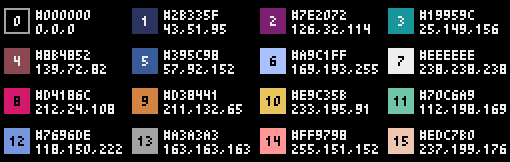

## SPACE INVADERS

apqrn5

Tu es prêt à coder ton premier jeu ? 

Un truc bien vintage , avec juste quelques couleurs, et un module de python qui va te faciliter la tache , Pyxel.

### Débuter

Voici [le lien](<https://github.com/kitao/pyxel/blob/main/docs/README.fr.md>)   pour une documentation complète du module pyxel

On y retrouve par exemple les couleurs possibles  et le numéro à utiliser pour les obtenir.

On va travailler en ligne sur le site https://www.pyxelstudio.net 

Une fois le site chargé:

 * Vous cliquez sur Create
 * Vous enregistrez  le lien qui vous est donné pour pouvoir retroucver votre travail
 * Vous allez coder dans la fenêtre de gauche , sous _import pyxel_
 * Et vous codez le jeu de space invaders :grin:
### Le début du jeu: Fixer la fenêtre et dessiner un vaisseau.

 Il y a dans notre progamme deux fonctions très importantes : draw et update ...la première dessine et la seconde met à jour .

 Donc , on fixe notre cadre, on place notre vaisseau dans le cadre en le dessinant (hyper basiquement, ne revez pas ! ), on le fait bouger et ...c'est déjà pas mal !

 Voici l'exemple 1 donné par la documentation: 

```py
import pyxel

pyxel.init(160, 120)      # on crée une fenêtre de 160 par 120

def update():
    if pyxel.btnp(pyxel.KEY_Q):   # appuyer sur la touche Q fait quitter 
        pyxel.quit()

def draw():
    pyxel.cls(0)   # on efface
    pyxel.rect(10, 10, 20, 20, 11) # on dessine un carré de coté 20 au point de coordonnées (10,10), couleur 11 soit vert clair.

pyxel.run(update, draw) # on met à jour , on dessine .

```

A l'aide cet exemple :

* Créer une fenêtre carrée de 128 de coté

* Créer deux variables vaisseau_x et vaisseau_y et leur affecter à chacune une abscisse et une ordonnée (entre 0 et 128 :grin:)

* Créer une fonction deplacement_vaisseau donc voici la documentation

```py
def deplacement_vaisseau (x,y):
    """ Cette fonction permet de dpélacer la position du vaisseau:
    On utilisera la touche gauche (KEY_LEFT) pour aller vers la gauche, et les touches KEY_RIGHT, KEY_UP,KEY_DOWN pour les autres déplacements.
    On utilisera btn au lieu de btnp de l'exemple
    ATTENTION : l'origine du repère est en haut à gauche (coordonnées (0,0))
    entrée : Les coordonnées du vaisseau avant le mouvement
    sortie : les coordonnées du vaisseau après le déplacement
    """
    pass

```
 * Compléter la fonction update() ci dessous

```py


def update():
    """ cette fonction met à jour les coordonnées du vaisseau
    """
     global vaisseau_x, vaisseau_y
     pass
```
 * Compléter la fonction draw()

```py

def draw():
    """ Cette fonction  efface l'ecran et dessine un vaisseau carre de coté entre 7 et 9 , à votre choix . Vous avez le choix de la couleur
    """
    pyxel.cls(0)
    pyxel.rect(......)

pyxel.run(update, draw)
```
### Correction partie 1

```py
# Pyxel Studio
import pyxel

# taille de la fenetre 128x128 pixels
# ne pas modifier
pyxel.init(128, 128)

# position initiale du vaisseau
# (origine des positions : coin haut gauche)
vaisseau_x = 60
vaisseau_y = 60


def vaisseau_deplacement(x, y):
    """déplacement avec les touches de directions.
    Retourne le nouvelles coordonnées
    """

    if pyxel.btn(pyxel.KEY_RIGHT):
        x = x + 1

    # à continuer
    return x, y


# =========================================================
# == UPDATE
# =========================================================
# =========================================================
# == UPDATE
# =========================================================
def update():
    """mise à jour des variables (30 fois par seconde)"""

    global vaisseau_x, vaisseau_y, 

    # mise à jour de la position du vaisseau
    vaisseau_x, vaisseau_y = vaisseau_deplacement(vaisseau_x, vaisseau_y)

    

# =========================================================
# == DRAW
# =========================================================
def draw():
    """création des objets (30 fois par seconde)"""

    # vide la fenetre
    pyxel.cls(0)

    # vaisseau (carre 8x8)
    pyxel.rect(vaisseau_x, vaisseau_y, 8, 8, 11)

    

pyxel.run(update, draw)
```