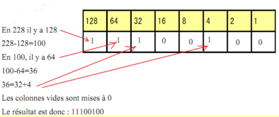

Le binaire

### Ecriture d'un entier en base 2 (ou en binaire)

#### Le système décimal 
Il s’appuie sur 10 symboles :0,1,2,3,4,5,6,7,8,9
Prenons par exemple le nombre 678.
En fait, ce nombre a été construit de la manière suivante : 678= 6*10²+7*10+8
 6 est le chiffre de rang 2 (ou centaine), 7 celui de rang 1 (ou dizaine) et 8 celui de rang 0 ou unités.
Tous les nombres écrits dans le système décimal sont décomposables à l’aide des puissances de 10. Lorsque le rang des unités est plein (à 9), on augmente le rang suivant d’une unité et on réinitialise à 0 le rang qui était plein. Si le rang suivant est lui aussi plein , on réinitialise à 0 les deux rangs et on ajoute 1 au rang suivant, etc…
#### Le système binaire 
Le système binaire s’appuie sur deux symboles, le 0 et le 1 , mais fonctionne exactement comme le système décimal . Dès qu’un rang est plein, on augmente de 1 celui d’après et on réinitialise à 0. Voici la construction de l’écriture des premiers entiers en binaire.

  

|décimal| binaire|       
| :---: | :----: |
| 0     | 0      |
| 1  | 1    |
 | 2  | 10        |
| 3| 11      |
| 4 | 100  |
| 5 | 101        |
| 6| 110      |
| 7 | 111  |
| 8 | 1000 |
| 9| 1001     |
| 10 | 1010  |
       

#### Passage du système décimal au binaire et réciproquement
   
!!!info   "Du décimal au  binaire"
     Il existe une méthode très simple pour passer du décimal au binaire. Cette méthode est fondée sur l’algorithme d’’Euclide et les restes successifs de la division euclidienne par 2 de l’entier que l’on veut convertir. On obtient une succession de reste (0 ou 1) . Il suffit de les écrire du dernier obtenu , qui doit être 1, au premier.
     Exemple : Convertissons 104 en binaire 

    |104| Reste de la division par 2|       
    | :---: | :----: |
     | 104=2*52|0|
       |52=2*26|0|       
       |26=2*13|0|
       |13= 6*2+1|1|
       |6=3*2|0|
       |3=2*1+1|1|
       |1=2*0+1|1|

       L'écriture binaire de 104 s'obtient en écrivant les restes obtenus du dernier au permier soit ici **1101000**

        > Un nombre pair se finira toujours par un 1 en binaire

#### Le binaire sur un octet

 *  L'unité de base en informatqiue est le bit , qui prend donc la valeur 0 ou 1
 * Un octet est composé de 8 bits .
 * Le plus petit nombre que l'on peut écrire sur un octet est 0 et le plus grand 255, qui correspond à 11111111
 * La notation internationale pour l'octet est _o_. On parlera alors de _ko_ (kilooctet), _Mo_ (Megaoctet);_Go_(Gigaoctet)...

  
!!! success "L'astuce pour écrire rapidement un nombre en binaire"  
  
    L'astuce repose sur la connaissance des puissances de 2 , jusqu'à $2^{7}$

     
     
     [source: siloged.fr](https://siloged.fr/cours/NSI/codage/Changementsdebases.html)

     Il suffit donc de voir si les différentes puissances de 2 "rentre" dans le nombre que l'on veut écrire . Si c'est le cas , on soustrait la;puissance de 2 au nombre à decimal et on reccomence avec la puissance inférieure .

!!! info  "Du binaire au décimal "

     Il peut être utile de savoir que la somme des deux plus grandes puissances,128+64, vaut 192. Ainsi tout nombre entre 192 et 255 aura ses deux bits les plus à gauche (on dit aussi de poids le plus forts ) égaux à 1 en écriture binaire.

     Le passage est plus facile . Il suffit d'additionner les puissances de 2 dont le bit correspondant en bianire est 1.

    !!! example "Exemple"
          01011010 : 0x128+1x64+0x32+1x16+1x8+0x4+1x2+0x1 =90
          
          Easy  :muscle:

### Ecriture d'un entier en base 16

Pour pouvoir écrire en base 16, il faut 16 symboles : les chiffres du système décimal plus les lettres A,B,C,D ,E,F (qui correspondent respectivement aux valeurs 10,11,12,13,14 et 15) . De la même façon que pour les deux bases vues précédemment, un nombre écrit en hexadécimal se décompose à l’aide des puissances de 16 et donc le passage de la base 16 à 10 est simple .
Ainsi  A8= 10*16+8=18410 où AB est un nombre écrit en base 16.

De même pour obtenir un nombre en hexadécimal à partir d’un nombre en décimal, on utilise la méthode des divisions successives par 16. Il suffit alors de réécrire les restes obtenus en commençant par le dernier jusqu’au premier.

!!! danger "Le truc en plus"

     En fait, il existe une méthode bien plus simple pour écrire un nombre en base 16.
     * On écrit notre nombre en base 2 
     * On groupe les bits 4 par 4 : Les 4 de gauche et les 4 de droite . On tra,scrit chaque groupe en hexadécimal...et c'est gagné 
     
    !!! example 
        * 165 s'écrit 10100101 en binaire 
        * On a deux groupes : 1010 soit A en hexa décimal (10 en décimal) et 0101 soit 5
        * L'écriture hexadécimale de 165 est A5 en hexadecimal
### Exercice 

  Remplir les cases vides 

|binaire| décimal|   hexadécimal|    
| :---: | :----: |  :---: |
| 01101001    |      |   |
| 11 |     |
 |  | 109        |
| |     |F4
|  | | CD
  
??? success "correction"

    |binaire| décimal|   hexadécimal|    
    | :---: | :----: |  :---: |
    | 01101001    |   105   |  69 |
    | 11 |    3 |3
    |  01101101| 109        |6D
    | 11110100|  244   |F4
    | 11001101 |205 | CD

### Représentation d'un entier relatif en binaire 

 * Sur un octet, le bit de poids le plus fort va servir à coder le signe de  l'entier : 0 pour les positifs et 1 pour les négatifs. 
 * On ne peut plus donc coder que les entiers entre -128 et 127 sur un octet

 La technique utilisée est appelée **complément à 2**

!!! danger "Le truc en plus"
    
     La technique pour coder un entier relatif:

     * On code la valeur absolue du nombre (exemple 68 si on veut coder -68)
     * On transforme les 0 en 1 et les 1 en 0
     * On ajoute 1

     La technique ultime : 

      * On code la valeur absolue du nombre (exemple 98 si on veut coder -68)
      * On part de la droite et on cahnge les les valeurs du bit **uniquement** après le premier 1

    !!! exemple "Exemple"

        codons -113 :

        * Etape 1 : 113, c'est 01110101 en binaire
        * Etape 2, on ne touche pas au premier 1 à droite, mais on change tous les autres bits : On obtient 10001001 pour le codage de -113

        Vérification : Additionnons les valeurs binaires de 113 et -113 

                 01110101             
                +10001011
                 ---------
             = 1 00000000   . On obtient bien 0 sur 1 octet.

### Exercice 
  
  Ecrire les entiers relatifs suivants en binaire avec la méthode du complément à 2 :    -121,  -8 , -128, -65.

  Quel est le plus petit nombre quel l'on peut écrire à votre avis sur 9 bits , 2 octets ?
??? success "correction"

    121  donne 01111001 donc -121 s'écrit 10000111

      8 s'écrit 00001000 donc  =8 s'écrit 11111000

      128 s'écrit 1000000 donc -128 s'écrit ....10000000

      65 s'ecrit 01000001 donc -64 s'écrit 10111111

     Sur 9 bits on peut aller jusqu'à  - $2^{9}$ et donc sur  2 octets , soit 16 bits , jusqu'à -$2^{16}$
  

### Représentation d'un réel en base 2

C'est le moment de bien écouter, c'est un peu plus dur :confused:

!!! info " Ecriture d'un nombre flottant en base 2"
    En base 10 , le nombre 61,154 est sous forme décomposée 6x$10^{1}$+1x$10^{0}$+1x$10^{-1}$+5x$10^{-2}$+4x$10^{-3}$
    De même, en base deux   1101,101 signifie 1x$2^{3}$+1x$2^{2}$+0x$2^{1}$+1x$2^{0}$+1x$2^{-1}$+0x$2^{-2}$+1x$2^{-3}$=11,625
     Il est plus difficile de passer de la base 10 à la base 2.
    Exemple : Ecrire 61,154 en base 2.
    Nous n’avons aucun problème à écrire 61 en base deux : 111101 
    Comment exprimer 0,154 en base 2 ?

         0,154 *2 =0.308	0
         0.308*2=0.616	0
         0.616*2=1.232	1
         0.232*2=0.464	0
         0.464*2=0.928	0
         0.928*2=1.856	1
         0.856*2=1.712	1
         0.712*2=1.424	1
         0.424*2=0.848	0  etc….

       On obtient donc 61,154 =111101,00100111…. en base 2	.
### Exercices 
1) Trouver la représentation décimale de 1101101,011

2) Trouver la représentation binaire  de 24,625
   

??? success "correction"

     1. La partie entière est 109 et on doit ajouter $2^{-2}$ +$2^{-3}$ soit 0.375 , donc au total 109,375

     2. 24 s'écrit 11000 et 0.625 = 0.5+0.125 soit $2^{-1}$ +$2^{-3}$ doonc 24,625 sécrit 11000,101

Remarques importantes : En base 10, 61,154 = 6,154x$10^{1}$ et 0.0061154= 6.154x$10^{-3}$

Il en va de même en base 2 : 1101,1101= 1,1011101*$2^{3}$, l’exposant 3 correspondant à un décalage de 3 vers la droite de la virgule.

De même 0.0011=1,1x$2^{-3}$, l’exposant -3 correspondant à un décalage de 3 vers la gauche.
 :warning: Un nombre décimal "fini" ne l'est pas forcément en binaire.

###  Représentation en machine d’un nombre flottant
Les machines utilisent une norme pour coder les nombres réels : La Norme IEEE 754. Pour cela , le nombre devra préalablement être écrit sous la forme 1,XXXXX.2e(avec e l'exposant)
!!! tip "La technique "
      •	Le nombre est codé sur 32 bits

      •	Le bit de poids le plus fort sert à coder le signe (0 pour positif, 1 pour négatif)

      •	L’exposant est codé sur les 8 bits consécutifs au signe.

      •	La mantisse est codée sur les 23 bits restants et correspondant aux bits situés après la virgule.

     La principale difficulté vient du codage de l’exposant : En effet, il nous faut pouvoir coder les exposants négatifs. Nous avons 8 bits et pouvons alors coder théoriquement 256 valeurs. Deux valeurs étant réservées, il nous reste 254 valeurs, que l’on fait varier de -126 à 127. Pour que l’exposant soit toujours positif, on ajoute 127 à la valeur de l’exposant.
     
       

     

    !!! example "Exemple" 

         Donnons le code en machine de 124,75

        Il nous faut d'abord écrire ce nombre en binaire : 1111100,11, je vous laisse vérifier maintenant que vous êtes balaises. :muscle:

        On écrit le nombre sous la forme adaptée :1,11110011x$2^{6}$

        bit 31 : C'est 0 puisque le nombre est positif

        8 bits de l'exposant : c'est donc 127+6 soit 133 : 10000101

        La mantisse : 11110011

        On obtient donc 0 10000101 111100110...............0 (32 bits au total)

        --------------------------------------------------------------------

        :fearful: Et donc l'autre sens ?????

        Allons y avec 0 10000001 01101   (on n'écrit pas les 0 finaux)

        Le signe est positif .
        L'exposant vaut 10000001 soit 129: +2 
        La mantisse : 01101 

        L'ecriture est donc **1**,01101 x$2^{2}$ :warning: NE PAS OUBLIER LE 1 AVANT LA VIRGULE

        Finalement on a 101,101 soit 5,625

### Exercice 

 1. Donner la représentation en machine de 177,5
 2. Quel est représenté en machine par 1 10000010 111101 ?

??? success "correction"
   
    1.  177: 10110001 et 0.5: 0.1  soit 10110001,1 ou avec la norme utilisée 1,01100011**$2^{7}$

    L'exposant à coder est 134, on obtient : 1 10000110 011000110....0  
   
    2. C'est un nombre négatif, l'exposant vaut 130 donc +3 

       On a donc 1,111101 x$2^{3}$ soit 1111,101 ou 15,625

    
