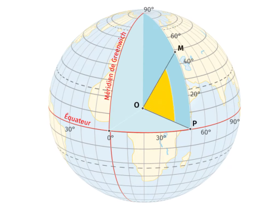
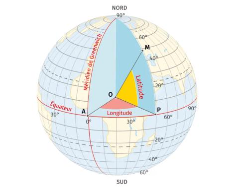

# 🌍 Latitude, Longitude, GPS et Géolocalisation (Niveau Seconde SNT)

---

## 📏 1. Latitude

- La **latitude** indique la position **Nord ou Sud** par rapport à l’équateur.
- Elle se mesure en **degrés (°)** de 0° à 90°.
- On ajoute:
  - **N** (Nord)
  - **S** (Sud)

👉 Exemple : Paris ≈ **48,8° N**

### Schéma

---

## 📐 2. Longitude

- La **longitude** indique la position **Est ou Ouest**.
- Elle se mesure par rapport au **méridien de Greenwich (0°)**.
- Valeurs de **0° à 180°** :
  - **E** (Est)
  - **O** (Ouest)

👉 Exemple : Paris ≈ **2,3° E**

### Schéma

---

## 📍 3. Coordonnées géographiques

On combine **latitude + longitude** :

👉 Exemple :
- Paris → **(48,8° N ; 2,3° E)**

---

## 🛰️ 4. Le GNSS

Le **GNSS (Global Navigation Satellite System)** est le système de positionnement par satellites.

Les principaux systèmes sont GPS (USA), Glonass (Russie) , Beidou ( Chine ) ou Galileo ( UE)
### ⚙️ Fonctionnement
1. Des satellites tournent autour de la Terre
2. Ton téléphone capte leurs signaux
3. Il calcule ta position grâce au temps de trajet des signaux

👉 Il faut **au moins 4 satellites** pour être précis.

Le GPS s’appuie sur la **trilatération** et non sur la triangulation. La trilatération implique de mesurer des distances. Elle est parfois confondue avec la triangulation qui implique la mesure d’angle.

Il ya la trilateration 2D et la trilateration 3D.

* Pour la **trilateration 2D**, il faut trois satellites pour obtenir l'intersction de 3 cerclres , c'est à dire un point.
* Pour la **trilateration 3D** , il faut 4 satellites pour obtenir l'intersection de 3 sphères . le 4 eme satellite est aussi nécessaire pour synchroniser les horloges afin de ne pas faire d'erreurs dans le calcul de la distance 