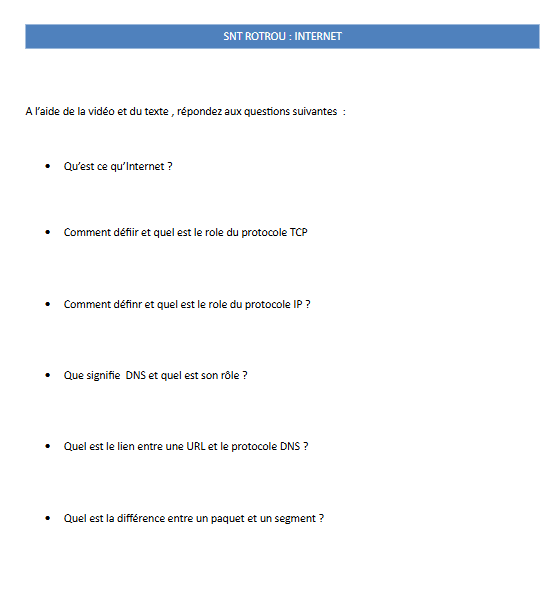
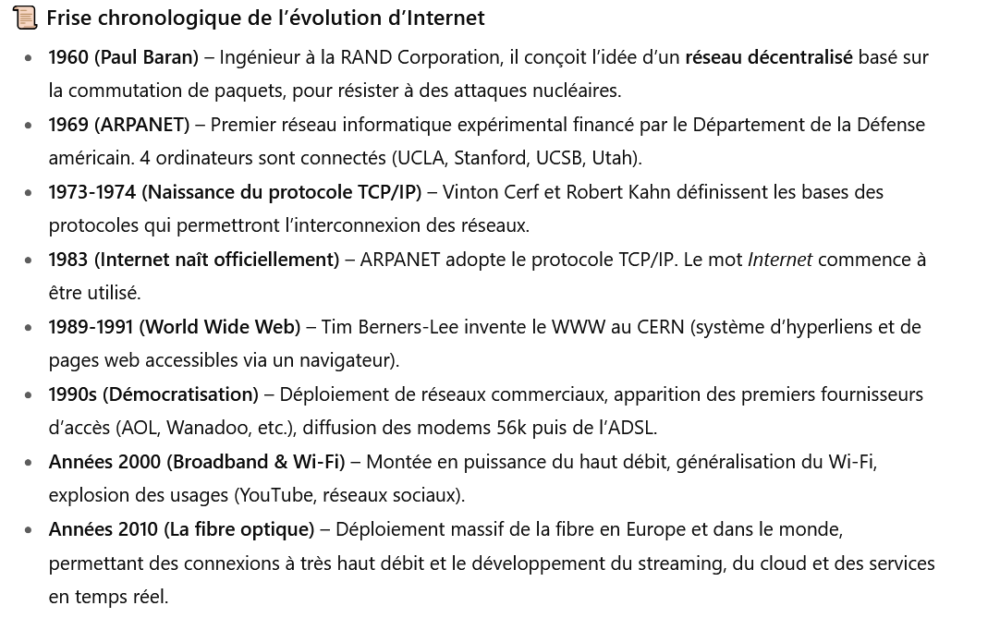
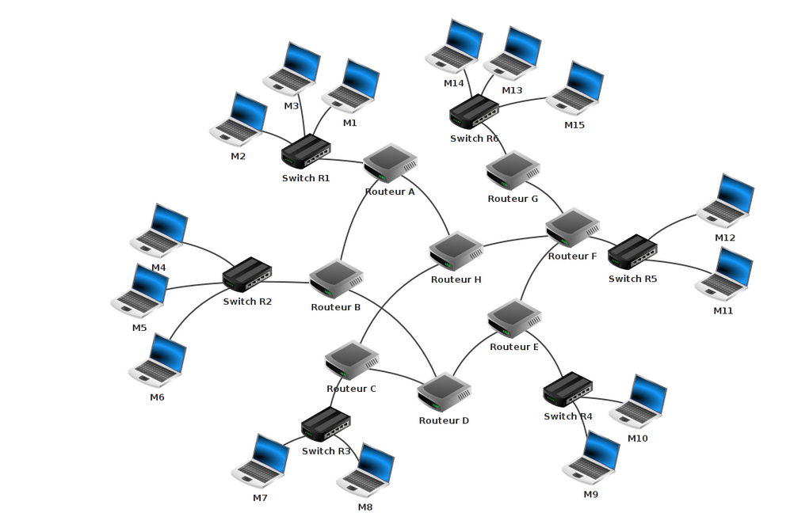

# INTERNET
<base target="_blank">

### Introduction
!!! note "INTRO"
      Internet, on entend ce mot quarante fois par jour. Mais, qu'est ce donc ? Et surtout comment ça marche ? 

!!! Example "Une video d'introduction"

    [Video](<https://www.youtube.com/watch?v=s18KtOLpCg4 >)

    
!!! Example "Un texte d'introduction"
    
   
     Que se passe-t-il lorsque vous tapez dans la barre d'adresse de votre navigateur «http://www.google.fr» ? Votre ordinateur va chercher à entrer en communication avec un autre ordinateur se trouvant probablement à des milliers de kilomètres de chez vous. Pour pouvoir établir cette communication, il faut bien sûr que les 2 ordinateurs soient « reliés ». On dira que nos 2 ordinateurs sont en réseau. Il existe énormément de réseaux (la plupart des ordinateurs du lycée sont en « réseau »), certains réseaux sont reliés à d'autres réseaux qui sont eux-mêmes reliés à d'autres réseaux... ce qui forme « des réseaux de réseaux de réseaux...». Savez-vous comment on appelle cet assemblage multiple de réseaux ? Internet !

     L'idée de relier des réseaux d'ordinateurs à d'autres réseaux d'ordinateurs date du début des années 70 avec le projet ARPAnet qui est, avec juste raison, considéré comme l'ancêtre d'internet.

     Afin de pouvoir s'identifier, tout ordinateur possède une adresse sur un réseau : son adresse IP.

     Une adresse IP est de la forme "74.125.133.94" (cette adresse IP correspond au serveur de google "google.fr")

     Les adresses IP sont de la forme : "a.b.c.d", avec a, b, c et d compris entre 0 et 255. Nous aurons l'occasion de revenir là-dessus un peu plus tard.

     N.B. Une autre norme est en train d'être déployée, la norme IPV6 (alors que les adresses IP vues ci-dessus appartiennent à la norme IPV4). Pourquoi cette nouvelle norme ? Parce qu' avec le système IPV4, il risque, dans les prochaines années, de manquer d'adresses IP disponibles sur internet.

     [site Pixees](<https://pixees.fr/informatiquelycee/n_site/snt_internet.html>)

!!! Danger "Remplir la fiche N1"
      
           [Téléchargez la fiche](FicheN1.odt)
        
### L'historique
!!! Example "Quelques dates importantes"
    
    

    **Travail à Faire** :  
                      
               1. Réaliser une frise 
                       
               2. Trouver aujourd'hui le pourcentage de la population qui est connecté à internet 
                      et le pourcentage d'utilisation de la fibre. 
                  En France , dans le monde et dans un pays de votre choix

        
### Le routage

!!! info "Définitions" 
        
       0. **Octet** :C'est l'unité de base utilisée en informatique pour quantifier les grandeurs . Chaque octets est composé de 8 symboles, appelés bits et prenant la valeur 0 ou 1.
       1. **Paquet** : C'est un ensemble de données qui transite sur le réseau. Un paquet a une taille très limitée(1500 octets maximum)
       2. **Routage** : C'est le mécanisme de transport d'un paquet de données d'une source à un destinataire .
       3. **Routeur**  : C'est l'équipement informatique qui assure l'acheminement des données de l'émetteur au destinaitaire . 
       

_un réseau informatique_

!!! info "Le fonctionnement du routage"

    Un ensemble de données doit être transmis depuis une machine A vers un machine B. La machine A est connectée à un réseau et la porte d'entrée de cette machine sur le réseau est souvent, au moins dans les habitations , une box. Cette box est un routeur et est en liaison avec ses routeurs voisins. Chacun possède une **table de routage** qui lui permet d'envoyer le paquet au bon endroit.

    Remarque : Lorsqu'une route est coupée, les routeurs ont toujours une solution pour acheminer les paquets : Ils trouvent un autre chemin. On peut faire l'analogie avec les GPS 
### Les protocoles de routage 
 Les transferts de données , les communications se font sur internet à l'aide d'une série de protocole selon un modèle appelé **TCP/IP**

 Un protocole est  un ensemble de règles/formes qui régissent une interaction ou une communication, que ce soit dans les domaines social, diplomatique, juridique ou informatique, afin d’assurer l’interopérabilité, la sécurité et le bon déroulement des échanges entre les parties ou systèmes. (définition IA de qwant )

 !!! info "Le modèle TCP/IP"
 
 

 
