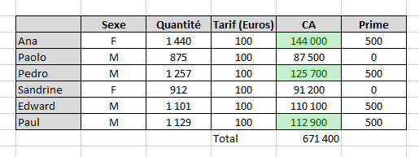
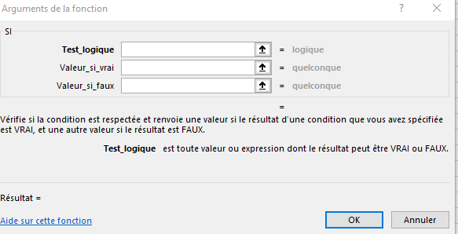

# Fonctionnalités d'Excel

## 1. Mise en forme conditionnelle

La mise en forme conditionnelle permet de changer l'apparence des cellules selon des règles.

- Sélectionner la plage de cellules.
- Aller dans l'onglet "Accueil" > "Mise en forme conditionnelle".
- Choisir une règle : valeurs en double, supérieures à, inférieures à, barre de données, dégradé de couleur, etc.
- Définir la condition et le format (couleur de fond, couleur du texte, bordure).

Exemple : mettre en jaune toutes les valeurs supérieures à 100.

## 2. Bloquer la première ligne

Bloquer la première ligne permet de conserver l'en-tête visible quand on fait défiler la feuille.

- Sélectionner la première ligne ou une cellule en dessous de la ligne à bloquer.
- Aller dans l'onglet "Affichage" > "Figer les volets" > "Figer la ligne supérieure".
- La première ligne reste visible lorsque vous descendez dans la feuille.

## 3. Code couleur des cellules

Le code couleur des cellules sert à repérer rapidement des informations.

- Sélectionner les cellules à colorer.
- Aller dans l'onglet "Accueil" > "Remplissage" (pot de peinture) pour choisir une couleur de fond.
- Pour changer la couleur du texte, utiliser l'icône de couleur de police.

Utiliser des codes couleur cohérents :

- vert pour les valeurs positives ou valides,
- rouge pour les erreurs ou les valeurs à surveiller,
- jaune pour les avis ou les éléments en attente.

## 4. Recopie d'un onglet

La recopie d'un onglet permet de copier une feuille de calcul entière.

- Cliquer droit sur l'onglet à copier en bas.
- Choisir "Déplacer ou copier".
- Cocher "Créer une copie".
- Sélectionner l'emplacement du nouvel onglet puis valider.

La copie conserve les données, la mise en forme et les formules de l'onglet d'origine.

## 5. Utiliser des formules de calcul

**Calculer le CA global (on suppose la colonne CA remplie):**

- Utiliser une formule de somme sur la colonne CA.
- Exemple : `=SOMME(D2:D20)` (adapter la plage à vos données).
- On peut cliquer sur _fx_ et choisir SOMME puis bien déterminer la plage où l'on veut faire le calcul.

**Calculer la moyenne de CA réalisé par chaque vendeur :**

- Pour une moyenne générale du CA : `=MOYENNE(D2:D7)`.
- Ou à nouveau se servir de la touche _fx_ et sélectionner la bonne fonction et la bonne plage.

**Calculer le CA par vendeur (on remplit la colonne CA)**
- Sélectionner la première cellule de la colonne CA (par exemple D2).
- Cliquer sur la barre de formule ou sur le bouton _fx_ pour entrer la formule.
- Saisir la formule de calcul, par exemple `=B2*C2` si B contient la quantité et C le prix unitaire.
- Valider par Entrée.
- Recopier la formule vers le bas pour toutes les lignes de la colonne CA en faisant glisser la poignée de recopie.

!!! success Utiliser une condition
    Exemple de primes selon le CA : On accorde 500 euros de prime à tout vendeur dont le CA dépasse les 100000

    ##### Méthode 1  :

    - Dans la cellule de la première ligne de données, saisir une formule conditionnelle.
    - Exemple : `=SI(D2>100000; 500; 0)` pour accorder 500 quand le CA dépasse 100000.

    ##### Méthode 2: 
     - Cliquez sur _fx_
     - Tapez logique puis rechercher 
     - Choisir Si . Apparait cette fenêtre :
    
    - Dans test_logique , entrer la condition (D2>100000) puis 500 dans si vrai et 0 si faux

## 6. Forcer les cellules avec validation

La validation des données permet de forcer le contenu des cellules selon une règle.

- Sélectionner les cellules à contrôler.
- Aller dans l'onglet "Données" > "Validation des données".
- Choisir un critère : entier, décimal, liste, date, texte, etc.
- Définir la règle et le message d'erreur.
- Cliquer sur OK.

Exemple : forcer une cellule à n'accepter que des nombres entre 1 et 100.
- Critère : "Entier".
- Données : "compris entre".
- Valeur minimale : 1.
- Valeur maximale : 100.

Quand un utilisateur saisit une valeur hors limite, Excel affiche un message d'erreur et empêche l'entrée.
