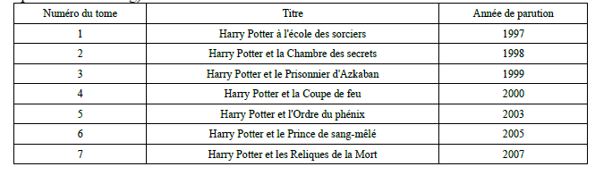

# Structures de données — niveau SNT
<base target="_blank">

## Introduction

Aujourd'hui , la data est au coeur de toutes les activités. Pas un jour sans entendre parler des data centers, les formations professionnelles autour des datas se multiplient. La data est au coeur de tout.
Il faut comprendre le passé pour prédire l'avenir. Pour cela, on doit étudier les données.

Aujourd'hui, la capacité à collecter ces données est très importante et nous avons les outils pour les traiter. 
L'intelligence artificielle s'appuie sur ces fameuses données. Les agents les exploitent afin de proposer leurs solutions. 

ici, nous allons nous intéresser à des exemples simples , en utilisant notamment des tableurs pour structurer puis exploiter ces données .

!!! success  " A retenir"
    Les structures de données permettent de :
    * Stocker
    * Structurer
    * Exploiter 

## Vocabulaire 

Un tel tableau s'appelle une **collection** ou une **table**.

Sur chaque ligne, on trouve un **enregistrement** ou un **objet**. 

Sur chaque colonne, on trouve un **descripteur**.

A l'intersection des deux se trouve **une donnée**.

Un enregsitrement est donc caractérisé par un certains nombres de données .

Une donnée peut prendre des valeurs de différentes natures : Cela peut être un nombre (entier ou réel), une chaine de caractères, une format spécial de type date ...

#### Exercice :
Dans le tableau ci dessus, citez les descripteurs  et expliquez ce que représente chaque objet de la collection.

## Format 

!!! info "Il existe plusieurs formats pour les structures de données "
    . Les formats xsl, xlsx, ods utilisés par des logiciels comme Excel , Libre Office ou Open Office.

    . Le format csv qui présente l'avantage de pouvoir être utilisé directement par des langages informatiques comme Python. Ce format est exploitable par des tableurs classiques.

    . Le format Json , adapté au langage javascript.

    . Le format sql , utilisé pour les bases de données qui regroupent des collections géantes .

## Activité 1

Par groupe de cinq, vous devez choisir quatre descripteurs qui permettent de faire deviner, sans citer son nom:

1. Un pays
2. Une voiture
3. Un individu
4. Un aliment

 
!!! success "A retenir"

     Les descriptifs sont fondamentaux pour bien classer et identifier les données .
     On retrouve cette exigence lorsqu'on écrit un prompt avec l'IA 

## Activité 2

Nous allons importer puis préparer nos données afin de les étudier .
Pour cela , vous aller vous rendre sur le site [data.gouv](<https://www.data.gouv.fr/>) et accéder aux données relatives aux incendies en France en 2024.
Pour retrouver le bon fichier :

  * Il est émis par IGN
  * Il s'agit de la base de données des incendies de forêt en France 
  * Vous devez arriver sur le site gouvernemenatl de l'agriculture
  * Le fichier que vous devez téléchargez est au format csv
  * Vous le téléchargez dans votre espace personnel  sous cette architecture:
 SNT/StructuresDeDonnes/incendies2024.csv

## Activité 3
 Votre fichier , sans être illisible , n'est pas très présentable. C'est un problème d'encodage des caractères.
 
  **Essayer de l'enregistrer au format csv, point virgule , utf8.**
 Une fois que votre fichier est "opérationnel", répondre aux questions sur la fiche d'exercices.

[Exercice ](Exercice.pdf)

## Datacenters et coût écologique
Les datacenters hébergent serveurs et stockent d'énormes quantités de données ; ils consomment beaucoup d'électricité pour le fonctionnement et le refroidissement. Cette consommation entraîne des émissions de CO2 selon la source d'énergie, et produit de l'équipement obsolète (e‑waste). Pour réduire l'impact : optimiser l'efficacité logicielle (moins de calculs inutiles), mutualiser les ressources (virtualisation), utiliser des centres conçus pour l'efficacité énergétique et privilégier les énergies renouvelables. Sensibiliser aux bonnes pratiques (supprimer les données inutiles, limiter les sauvegardes excessives) contribue aussi à diminuer l'empreinte écologique.

