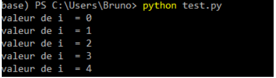
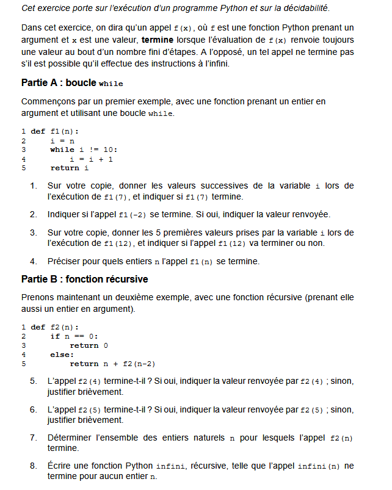
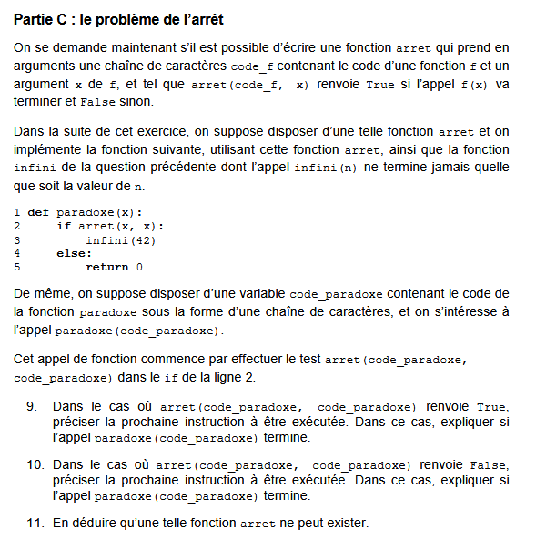
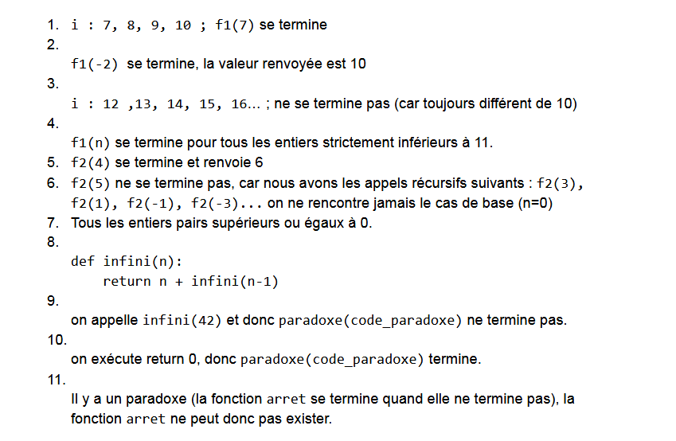

# <b> La décidabilité </b>

##  1. Introduction au problème

On va étudier les possibilités et les limites des algorithmes. 
Pour cela , on va considérer des programmes qui prennent comme données d'autres programmes . 

!!! example  " Exemple "
    On crée un petit programme python, que l'on va executer. On le donne au programme python qui va l'interpréter , 
    par exemple en ligne de commande . Le nom du programme est test.py
     
    ``` python  title="test.py"

      for i in range (5):
         print (f" valeur de i  = {i}")

    ```
    


##  2. La décidabilité

!!! abstract "Définition"
    On dit d'un problème qu'il est décidable si l'on peut répondre par oui ou par non à la question qu'il pose .
    Dans le cas contraire , le problème est dit <i>indécidable</i> .
    Si un problème est décidable , il existe un algorithme qui peut le résoudre .

    Rappel : Un algorithme est une <b>suite finie</b> d'instructions 

!!! example "Un exemple" 
    
    Existe -t-il un programme qui soit capable de calculer la somme des n premiers entiers positifs, n étant passé en paramètre ?...oui :smile:
    
    ``` python 

         def somme (n):
             S = 0
             for i in range (1,n+1):
                 S = S+i
             return S

    ```

!!! note  " L'HISTORIQUE"
    Au début du XXème siècle , David Hilbert, mathématicien allemand , s'intéresse aux problèmes mathématiques non résolus , ce qui aboutira en 1928 au problème de la décision , ou encore **Entscheidungsproblem**

    !!! info "Le Problème "
         <b> Existe-t-il un algorithme capable de déterminer, pour tout énoncé mathématique bien formulé donné en entrée, 
        si ce dernier est vrai ou faux ?</b>

    En 1931, Kurt Gödel a réglé la question : **Il existe des propriétés mathématiques non décidables dans n’importe quel système définissant l’arithmétique.**
`

## 3. Le problème de l'arrêt
 

Ce problème , étudié par Alan Turing en 1936, est le suivant : 
 
  > On considère une fonction mathématique qui prend en paramètre une fonction Python f et un paramètre *e* et qui renvoie True si le programme s'arrête et False sinon.
Nous appellons <b>arrêt</b> une telle fonction, en supposant qu'une telle fonction existe bien.
   
   
```python 
    def arret(prog, x):
        if "prog (x) s'arrête":   
            return True
        else :
             return False

```
On construit un aute programme qui, boucle à l'infini si arret renvoie True et renvoie 'Stop' si arret renvoie False 


```python  title="paradoxe"

    def paradoxe(prog):
        if arret(paradoxe, prog):   
            while True:
                pass
        else:
            return 'Stop'

```

!!! done  "Explication et contradiction"
      
      Considérons que le programme pris en paramètre par la fonction paradoxe est cette même fonction paramètre.

    * l'appel paradoxe(paradoxe) rentre dans une boucle infinie si arret(paradoxe, paradoxe) est vrai 
    donc si paradoxe(paradoxe) termine. Donc paradoxe(paradoxe) ne termine pas si paradoxe(paradoxe) termine...

    
    * l'appel paradoxe(paradoxe) termine si arret(paradoxe, paradoxe) est faux donc si paradoxe(paradoxe) ne termine pas.
    Donc paradoxe(paradoxe) termine si paradoxe(paradoxe) ne termine pas...
   

!!! tip "Conclusion"
    <b> On a démontré par l'absurde qu'un fonction arrêt ne peut exister puisque l'on est arrivé à une contradiction .</b>

##  4. Un exercice au bac  !

=== "Sujet"

    
    

=== "Correction"

     Cette correction est issue du site  [Pixees](https://pixees.fr/informatiquelycee/term/suj_bac/2024/correction_sujet_14.pdf)

      

