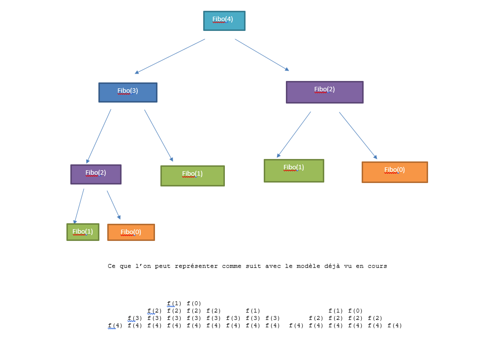

# Recursivité

### Introduction 

Jusqu'à ce jour, votre façon de programmer est dite itérative : L'ordinateur exécute les instructions les unes après les autres, les répétiotions sont gérées à l'aide des boucles while, for...

       On parle aussi de programmation impérative.

On va découvrir une autre façon de propgrammer, la récursivité .

### Principe de la récursivité

!!! tip "Les deux fondamentaux"

    * **Il faut une condition d'arrêt**
    * **Il faut que la fonction s'appelle elle même.**

!!! Example "Premiers exemples"
     
 
     1. #### Somme des n premiers entiers 
   

    !!! done "Programme iteratif"
         ```py 
          def somme (n):
             S= 0
             for i in range(n+1):
               S = S+i
             return S

         ```
    !!! done " Programme récursif"

               
          ```py 
           
           def somme_rec(n):
              if n == 0:
                 return 0
              return somme_rec (n-1) +n
          ```
      2. #### Puissances d'un entier 

    !!! done "Programme iteratif"
         ```py 
          def puissance (a,n):
             return a**n

         ```
    !!! done " Programme récursif"

               
          ```py 
           
           def puissance_rec(a,n):
              if n == 0:
                 return 1
              return puissance_rec(a,n-1)*a
          ```

   

Pour bien comprendre le fonctionnement des programmes, vous pouvez utiliser le site [python tutor](https://pythontutor.com/)

### Fibonnaci et la limite de la récursivité 

En mathématiques, la suite de Fibonacci est une suite d'entiers dans laquelle chaque terme est la somme des deux termes qui le précèdent. Elle commence par les termes 0 et 1.

On a donc **fibo(0) =0, fibo(1) = 1, fibo(2) = 1 et fibo(n) = fibo(n-1) +fibo(n-2)** 

On va écrire une fonction récursive qui prend en paramètre un entier n (correspondant au dernier indice de la suite à calculer) et qui renvoie le terme de rang n de la suite de Fibonacci.

Il nous faut trouver, pour programmer la fonction récursive : 

* La formule de recursivité (récurrence pour les matheux) liant le terme de rang et son ou ses précédents.

* Une issue de secours pour être sur de terminer le programme.

    !!! done "Programme iteratif"

          ```py
           def fibo(n):    
               a = 0
               b = 1
               for i in range(2,n+1):
                   c= a+b
                   a = b
                   b = c
               return b
  

           assert(fibo(4) == 3)
          ```
    !!! done "Programme recursif"

          ```py
          def fibo_rec(n):
              if n == 0 or n == 1:
                 return n
              return fibo_rec(n-1)+ fibo_rec(n-2)
          ```

Examinons ce qu'il se pense avec l'appel de fibo(4) :


La fonction fibo_rec est appelée plusieurs fois avec la même valeur. Cela ne va -t-il poser un problème pour des valeurs de n plus grande ?

!!! danger "Dépassement des capacités de calcul"
    Un petit script permet de calculer le nombre de fois où la fonction fibo_rec(15) appelle fibo_rec(2) :...150 ! 
     On trouvera une solution à ce problème en fin d'année avec la programmation dynamique !   :muscle: