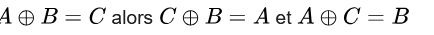
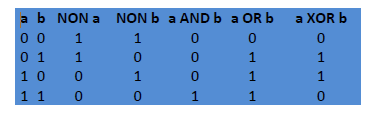

# Sécurisation des communications

## 1. Introduction

On a vu en première comment deux ordinateurs communiquaient à travers la relation client serveur . Une fois la connexion établie , les échanges de données se font à l’aide du protocole http.

Sur internet les communications se font en utilisant une série de protocoles , organisés en couche :


   	* Couche matérielle (ethernet, fibre…)
   	* Couche internet , avec le protocole IP
   	* Couche transport avec les protocoles UDP et TCP par exemple
   	* Couche d’application avec les protocoles de haut niveau comme http, Imap…

Les données transmises sont découpées en paquets qui transitent de routeurs en routeurs et peuvent donc être lues…Ce qui n’est pas top , notamment pour tout ce qui touche aux transactions bancaires.

On est donc amené à sécuriser les communications  avec plusieurs contraintes :

	* S’assurer que le client se connecte au bon serveur
	* S’assurer que le contenu d’une trame ne soit lisible que par la source et la destination.
    * Ne pas rendre la pocédure de chiffrage trop lourde afin de ne pas ralentir la communication.

Deux techniques principales ont émergé :

	* Le chifrement symétrique 
	* Le chiffrement asymétrique 

## 2. Le chiffrement symétrique 
Utiliser un chiffrement symétrique signifie coder et décoder avec une même clé .
Cela signifie qu’aux deux bouts de la chaine , la clé de codage et de décodage est connue et a la même valeur . C’est le cas lors de cryptage simple comme le codage Cesar ou le code de Vigenere.

**Exemple de codage en python du code Cesar :**
``` py 
 def code(mot, decalage):
    mot= mot.upper()
    decalage= decalage%26
    nv_mot = ''
    for lettre in mot :
        a = ord(lettre) +decalage
        if a>90       :
            a= a-26
            
        nv_mot += chr(a)
    return nv_mot
```
La fonction decodage va utiliser la même clé 
``` py
def decode(mot, decalage):
    mot= mot.upper()
    decalage= decalage%26
    nv_mot = ''
    for lettre in mot :
        a = ord(lettre) - decalage
        if a<65:
            a= a+26
            
        nv_mot += chr(a)
    return nv_mot
```


### L'opérateur Xor 
Le cryptage à l’aide de l’opéarteur Xor est aussi à classer dans la catégorie des chiffrements symétriques.

La propriété importante du Xor est  :



On code A à l’aide de la clé B, on obtient C. 
Pour décoder il suffit d’additionner, avec XOR,  le message crypté et la clé .

Rappel des tables des opérateurs booléens


### Avantages et inconvénients du chiffrement symétrique 

Les algorithmes de chiffrements symétriques possèdent l’avantage d’être pratiques et faciles à mettre en place. Mais ils sont peu sécurisés. En effet, les intervenants doivent échanger la clé : S’ils ne peuvent se rencontrer, ils sont amenés à utiliser un moyen de communication non sécurisé pour s’échanger la clé et donc sont amenés à se faire pirater.
Il a donc fallu imaginer un système de cryptage où l’échange de clé se fait de façon sécurisé ou n’impacte pas la sécurité de la communication : C’est le chiffrement asymétrique , mis en place à partir des années 70.
