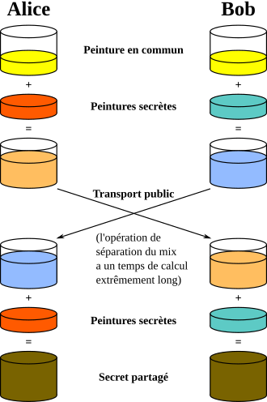
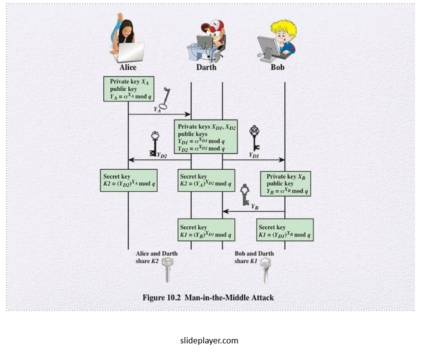
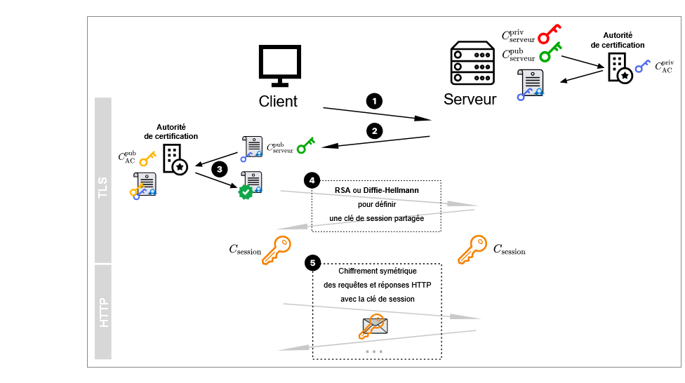

# Sécurisation des communications

## 1. Introduction

On a vu en première comment deux ordinateurs communiquaient à travers la relation client serveur . Une fois la connexion établie , les échanges de données se font à l’aide du protocole http.

Sur internet les communications se font en utilisant une série de protocoles , organisés en couche :


   	* Couche matérielle (ethernet, fibre…)
   	* Couche internet , avec le protocole IP
   	* Couche transport avec les protocoles UDP et TCP par exemple
   	* Couche d’application avec les protocoles de haut niveau comme http, Imap…

Les données transmises sont découpées en paquets qui transitent de routeurs en routeurs et peuvent donc être lues…Ce qui n’est pas top , notamment pour tout ce qui touche aux transactions bancaires.

On est donc amené à sécuriser les communications  avec plusieurs contraintes :

	* S’assurer que le client se connecte au bon serveur
	* S’assurer que le contenu d’une trame ne soit lisible que par la source et la destination.
    * Ne pas rendre la pocédure de chiffrage trop lourde afin de ne pas ralentir la communication.

Deux techniques principales ont émergé :

	* Le chifrement symétrique 
	* Le chiffrement asymétrique 

## 2. Le chiffrement symétrique 
Utiliser un chiffrement symétrique signifie coder et décoder avec une même clé .
Cela signifie qu’aux deux bouts de la chaine , la clé de codage et de décodage est connue et a la même valeur . C’est le cas lors de cryptage simple comme le codage Cesar ou le code de Vigenere.

**Exemple de codage en python du code Cesar :**
``` py 
 def code(mot, decalage):
    mot= mot.upper()
    decalage= decalage%26
    nv_mot = ''
    for lettre in mot :
        a = ord(lettre) +decalage
        if a>90       :
            a= a-26
            
        nv_mot += chr(a)
    return nv_mot
```
La fonction decodage va utiliser la même clé 
``` py
def decode(mot, decalage):
    mot= mot.upper()
    decalage= decalage%26
    nv_mot = ''
    for lettre in mot :
        a = ord(lettre) - decalage
        if a<65:
            a= a+26
            
        nv_mot += chr(a)
    return nv_mot
```


### <h1>L'opérateur Xor</h1>
Le cryptage à l’aide de l’opéarteur Xor est aussi à classer dans la catégorie des chiffrements symétriques.

La propriété importante du Xor est  :


On code A à l’aide de la clé B, on obtient C. 
Pour décoder il suffit d’additionner, avec XOR,  le message crypté et la clé .

Rappel des tables des opérateurs booléens


### <h1>Avantages et inconvénients du chiffrement symétrique</h1>

Les algorithmes de chiffrements symétriques possèdent l’avantage d’être pratiques et faciles à mettre en place. Mais ils sont peu sécurisés. En effet, les intervenants doivent échanger la clé : S’ils ne peuvent se rencontrer, ils sont amenés à utiliser un moyen de communication non sécurisé pour s’échanger la clé et donc sont amenés à se faire pirater.
Il a donc fallu imaginer un système de cryptage où l’échange de clé se fait de façon sécurisé ou n’impacte pas la sécurité de la communication : C’est le chiffrement asymétrique , mis en place à partir des années 70.

## 3. Le chiffrement asymétrique 


On va présenter ici la méthode de __Diffie Hellman__. 

### Diffie Hellman

__Le chiffrement asymétrique__ est fondé sur la donnée de deux clés , une publique , une privée.
Soit Alice et Bob de part et d’autre de la communication : Ils  se mettent d’accord sur une clé commune  qu’ils échangent. Appelons la x
Ils ont chacun une clé privée. Ils associent la clé publique et leur clé privée ( a pour alice et b pour Bob) et s’échangent les résultats. 
(ça peut ête la multiplication des deux clés, par exemple ). 
Les propriétés des clés font que si quelqu’un intercepte ax , même connaissant x , il ne peut pas dans un temps décent retrouver a.
Une fois reçu les résultats (Alice reçoit xb) et Bob (xa), Alice et Bob  multiplie le résultat par leur clé et les deux obtiennent le même résultat , abx…
On notera que si quelqu’un intercepte ax et bx , il ne peut pas former abx, mais seulement abx²…
Expliquons cela avec des pots de peinture …..




_Source_ : https://fr.wikipedia.org/wiki/%C3%89change_de_cl%C3%A9s_Diffie-Hellman


### Le RSA


Le système RSA est un système de chiffrement asymétrique fondé sur des paires de clés privées et publiques . Ce système repose sur les propriétés des nombres premiers. 

 

Chaque intervenant possède une clé  privée et une clé publique . Soit Apriv et Apub les clés privés et publiques d’Alice. Soit m un message . Les clés ont cette propriété  Apriv(Apub(m)) = Apub(Apriv (m)). 

De plus : 

    Connaissant une de des deux clés , il est impossible de connaitre l’autre. 

    Connaissant (Apriv (m) ou Apub(m) , il est impossible de retrouver m. 

A partir de là, voici le déroulement du chiffrement et déchiffrement  d’un message . 

Alice envoie sa clé publique à Bob (cette clé est visible par tout le monde) 

Bob chiffre son message m à l’aide la clé publique d’ Alice et envoie le résultat Apub(m) 

Alice , une fois le message reçu, n’a plus qu’à appliquer sa clé privée pour retrouver le message initial. 

Le problème principal de ce système est son coût en terme de calculs . 

Mais il peut servir à crypter une clé publique qui servira ensuite pour un chiffrement symétrique . 

Cette technique de chiffrement a quand même un important défaut : Elle n'assure pas que les intervenants soient les bons . En gros , un des deux protagonistes peut avoir été remplacé par un usurpateur comme le montre le schéma ci dessous
   


Il faut donc trouver une autrre technique pour s'assurer de communiquer avec la bonne personne . 
Voici un procédé souvent utilisé 

## 4. Authentification des participants

On a vu que ce type de chiffrement  n’évitait pas l’attaque du MITM , à l’aide d’une usurpation d’identité. 

C’est le cas lors du fishing, où par exemple, on demande à un utilisateur de se connecter à  un site pour changer ses identifiants . Et bien entendu, une fois les nouveaux identifiants récupérés , se connecter au site voulu.  

On va donc s’asurer de l’identité des correspondants. 

Lorsque l’on veut prouver son identité sur internet, on présente un __certificat__ qui est délivré par une autre entité, appelée tiers de confiance.. 

!!! danger Remarque
    Vous avez peut être été en présence d'une page où l'on vous déconseille de poursuivre sur le site que vous voulez atteindre. Vous pouvez quand même le faire , à vos risques et périls . C'est surement que le site ne propose pas de certificats prouvant son authenticité


Voici le procédé : Communicant  A et B , tiers de confiiance T 

__Etape 1__ :  B contacte T. Celui-ci vérifie qu’il s’agit bien de B. Et T utilise sa clé privée pour chiffrer la clé publique de B : On a  CprivT CpubB : On obtient un certificat  s 

__Etape 2__ :  A veut se connecter à B , qui lui fournit sa clé publique , CpubB  , ainsi que le certificat s. 

__Etape 3__ : A récupère la clé publique de T , CpubT. On a alors CpubT(CprivT(CpubB) = CpubB. A peut comparer avec la clé publique qu’elle a reçue à l’étape 2. 

Maintenant que l’on est sur de l’identité des participants, on peut se mettre d’accord sur une clé de chiffrement, par exemple,  avec Diffie Hellman 

## 5. Le protocole HTTPS

Le protocole __HTTPS__ (Hypertext Transfer Protocol Secure) est une extension du protocole HTTP qui sécurise la communication entre un client (un  navigateur) et un serveur web. Son objectif principal est de garantir la confidentialité et l'intégrité des données échangées.
C'est la combianison du protocole HTTp et d'un protocole assurant la sécurisant de la communication , par exemple TSL.

!!!info Voici les points clés à retenir concernant HTTPS :

    Chiffrement des communications : HTTPS utilise le protocole SSL/TLS (Secure Sockets Layer / Transport Layer Security) pour chiffrer les données. Cela signifie que les informations que vous envoyez (par exemple, lors d'une connexion à un site bancaire) et celles que vous recevez sont rendues illisibles pour quiconque tenterait de les intercepter.

    Authentification du serveur : Pour s'assurer que vous communiquez bien avec le site web légitime et non avec un imposteur, HTTPS utilise des certificats numériques. Ces certificats sont émis par des autorités de certification reconnues et permettent de vérifier l'identité du serveur.

    Intégrité des données : En plus du chiffrement, HTTPS garantit que les données n'ont pas été modifiées pendant leur transmission.

    Interaction client-serveur : Comme pour HTTP, la communication se fait entre un client et un serveur. Dans le cas de HTTPS, c'est le serveur qui propose un certificat pour établir la connexion sécurisée. Le client (votre navigateur) vérifie ce certificat, on a vu comment dans l'authentification des utilisateurs.

    

En résumé, HTTPS est essentiel pour sécuriser les échanges sur le web, particulièrement lorsqu'il s'agit de données personnelles, financières ou confidentielles.

[Lien source : info-mounier](https://info-mounier.fr/terminale_nsi/archi_se_reseaux/securisation-communications-exercices)

!!! info  Les étapes de HTTPS

     * Etape 1 : Le serveur crypte sa clé publique avec la clé privée de l'autorité de certification : On obtient le certificat de sécurité
     * Etape 2 : Le serveur envoie le certificat et sa clé publique 
     * Etape 3 : L'autorité de certification fournit sa clé publique au client qui l'applique au certificat et retrouve ainsi la clé publique du serveur et peut la comparer à celle qu'il a reçue à l'étape 2.
     * Etape 4 : les deux protagonistes peuvent choisir une clé pour la session. Cette clé peut par exemple être définie à l'aide de Diffie Hellman