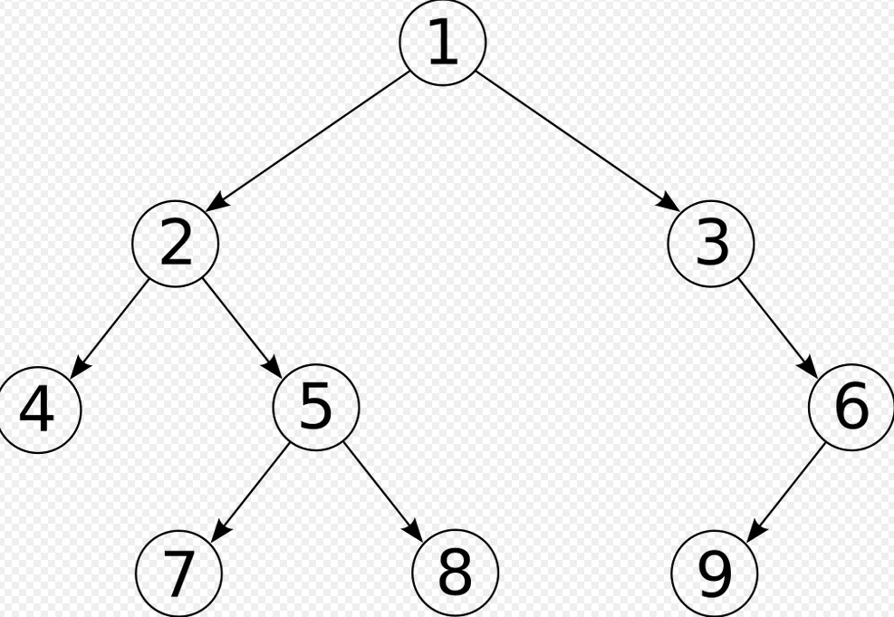

# Algorithme sur les arbres 

## 1. Implémentation d'un  arbre à l'aide d'une classe 

On va très simplement créer une classe Noeud qui aura trois attributs : v, g et d, représentant respectivement la valeur du noeud(None par défaut) , son sous arbre droit ( None par défaut ) et son sous arbre gauche (None par défaut)
On va définir trois méthodes, en plus de la méthode constructeur:

!!! note "
    * est_vide : Renvoie un booléen 
    * est_feuille : Renvoie un booléen 
    * taille : Renvoie la taille de l'arbre 
     (plus fréquent sous forme de fonction que de méthode) 
    


```py
class Noeud :
    def __init__ (self,valeur= None , gauche = None,droite = None):
        self.v = valeur
        self.g = gauche
        self.d = droit

    def est_vide(self):
        return self.valeur == None 

    def est_feuille(self):
        return self.g== None and self.d == None 
    
     
    def taille(self):
        if self is None :
            return 0
        elif self.est_une_feuille():
            return 1
        elif self.d is None :
            return 1+self.g.taille()
        elif self.g is None :
            return 1+self.d.taille()
        else :
             return 1+self.g.taille()+self.d.taille()

    
```
!!! danger " Attention danger ! "
     Vérifier bien si vous êtes en présence d'une méthode ou d'une fonction pour la taille ou la hauteur !
     La hauteur est plus compliquée en implémenter en tant que méthode 

     Dans le cas d'une fonction , on obtient , pour la taille, avec un paramètre arbre de la classe Noeud:

     ```py
        def taille (arbre):
            if arbre is None :
                return 0
            return 1+ taille(arbre.g)+ taille (arbre.d)

     ```

     Et pour la hauteur 

     ```py
        def hauteur (arbre):
            if arbre is None :
                return 0 # On peut rencontrer -1
            return 1+ max(self.gauche.hauteur()+self.droite.hauteur())
     ``` 
!!! success "Remarque"

    * Soit n la taille d'un arbre . Alors sa hauteur h vérifie :

        log<sub>2</sub>(n) <= h<= n-1
    * Soit h la hauteur d'un arbre . Alrs sa taille n vérifie :
  
        h <= n <= $2^{h}-1$

    Dans le cas où la taille d'un arbre est égale à $2^{h}-1$, on dit que l'arbre est complet 


## 2. Parcours d'un arbre 
      *source : wikipedia*
### a. Parcours en largeur 
 !!! note ""
    Il s'agit ici de parcourir l'arbre ligne par ligne de la gauche     vers la droite.

    Parcours largeur : 1 2 3 4 5 6 7 8 9


    ```py
    def ParcoursLargeur(arbre):
    if arbre is None:
        return 
    file = []
    file.append(arbre)
 
    while(len(file) > 0):
        # afficher et retirer le premier élément
        print(file[0].v)
        noeud = file.pop(0)
 
        # ajouter l'enfant gauche de l'élément retiré
        if noeud.g is not None:
            file.append(noeud.g)
 
        # ajouter l'enfant droit de l'élément retiré
        if noeud.d is not None:
            file.append(noeud.d)
    ```

### b. Parcours en profondeur 

#### 1.Prefixe 
!!! note ""

    On visite le noeud, on va à gauche , on va à droite.
   
    Parcours profondeur préfixe :1 2 4 5 7 8 3 6 9

    ```py
         def ParcoursPP (arbre):
            print(arbre.v)
            ParcoursPP(arbre.g)
            ParcoursPP(arbre.d)
    ```
#### 2. Suffixe
  
 !!! note ""

    On va à gauche , on va à droite , on visite le noeud

     Un parcopurs suffixe (postfixe) se termine par la racine de l'arbre 
   
     Parcours profondeur suffixe:4 7 8 5 2 9 6 3 1


    ```py
        def ParcoursPS (arbre):        
            ParcoursPS(arbre.g)
            ParcoursPS(arbre.d)
            print(arbre.v)
    ```
 #### 3. Infixe
  
 !!! note ""

    On va à gauche ,on visite le noeud  , on va à droite 

     Un parcopurs infixe classe les él"éments par ordr croisdsant dans le cas d'un arbre binaire de recherche
   
     Parcours profondeur suffixe:4 7 8 5 2 9 6 3 1


    ```py
        def ParcoursPI (arbre):        
            ParcoursPI(arbre.g)
            print(arbre.v)
            ParcoursPI(arbre.d)
            
    ```
 