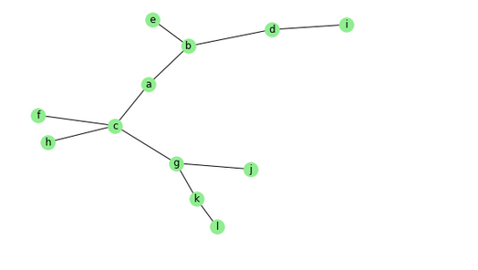

# Algorithmes sur les graphes 

On va s'intéresser aux parcours de graphe. il existe dexu types de parcours principaux : 

* Le parcours en largeur   ou BFS
* le parcours en profondeur ou DFS

## 1. Le parcours en largeur 

!!! note " Le principe" 

    On va utilser un structure de file pour stocker nos sommets en cours de visite et une liste pour stocker nos sommets visités

    1. On part d'un sommet, on l'ajoute dans la file .
    2. On parcourt les voisins du sommet. S'ils n'ont pas été visités, on les insère dans la file puis on défile le premier élément de la file, on l'ajoute à la liste des visités  et on répète le point 2 tant que la file n'est pas vide 

??? Example  "Exemple"
    


    Le sommet de départ est a
  

    |visités| file | étape|
    |--------- | ------------------ | ------ |
    |[a]|b,c| Le sommet de départ a est marqué visité. On enfile ses voisins, ordre aléatoire|
    |[a,b]|c,e,d| b est visité, on ajoute ses voisins à la file ...sauf a qui est déjà visité|
    |[a,b,c]| e,d, g,f,h| c est visité, on ajoute ses voisins ...sauf a |
    |[a,b,c,e]| d,g,f,h| e est visité , aucun voisin non visité|
    |[a,b,c,e,d]| g,f,h,i| d est visité , i est ajouté à la file|
    |[a,b,c,e,d,g]| f,h,i,k,j| g est visité, k et j ajouté à la file |
    |[a,b,c,e,d,g,f]| h,i,k,j| f est visité |
    |[a,b,c,e,d,g,f,h]| i,k,j| h est visité |
    |[a,b,c,e,d,g,f],h,i| k,j| i est visité |
    |[a,b,c,e,d,g,f,h,i,k]| j,l| k est visité, l ajouté |
    |[a,b,c,e,d,g,f,h,i,k,j]| l| j est visité, l ajouté |
    |[a,b,c,e,d,g,f,h,i,k,j,l]| | l visité, file vide ---> l'algorithme s'arrête |


!!! success "A retenir"
    Lors d'un parcours en largeur , on visite les sommets à la distance 1 du sommet de départ, puis ceux à la distance 2 , etc.. Il ya plusieurs parcours en largeur possible à partir d'un sommet.

!!! note "L'algorithme "

    ``` py
    def BFS(graphe,s):
        """ Ce programme prend en paramètre un dictionnaire dont les    
        clés sont les sommets du graphe et les valeurs 
        une liste des sommets adjacents à la clé.
        Renvoie un parcours en largeur du graphe à partir du sommet s
        """
        
        visite =[]
        file =[s]
        while file !=[]:
              a = file.pop(0)
              visite.append(a)
              for v in G[a]:
                     if v not in visite :
                          file.append(v)
        return visite
    ```

  


## 2. Le parcours en profondeur

!!! note " Le principe" 

    On va utilser un structure de pile  pour stocker nos sommets en cours de visite et une liste pour stocker nos sommets visités

    1. On part d'un sommet, on l'ajoute dans la pile  . 
    2. On dépile . Si le sommet dépilé n'est pas visité, on l'ajoute à visite et on parcourt ses voisins. S'ils n'ont pas été visités, on les insère dans la pile et on répète le point 2 tant que la pile n'est pas vide 

??? Example "exemple"
    

    Le sommet de départ est A

    |visités| pile | étape|
    |--------- | ------------------ | ------ |
    |[A]|B,C| Le sommet de départ a est marqué visité. On empile ses voisins, ordre aléatoire|
    |[A,C]|B,E,D| C est marqué visité. On empile ses voisins, sauf B qui est déjà dans la pile |
    |[A,C,D]|B,E,F,G| D est marqué visité. On empile ses voisins, sauf C déjà visité|
    |[A,C,D, G]|B,E,F| G est marqué visité.  Ses voisins sont dans la pile ou visités.|


    Il ne reste plus qu'à dépiler  pour obtenir [A,C,D,G,F,E,B]

!!! success "A retenir"
    Lors d'un parcours en profondeur , on visite les sommets branche pas branche . On va le plus loin possible en visitant le maximum de sommets.


!!! note "Algorithme"

    ```py 
    def DFS(G,s):
        visite =[]
        pile =[s]
        while pile != []:        
            a =pile.pop()
            if a not in visite:
                visite.append(a)
                for v in G[a]:
                    if v not in visite:
                            pile.append(v)
        return parcours
    ```


