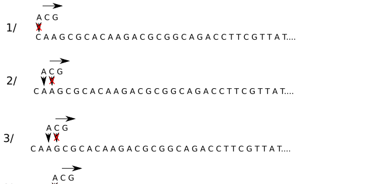
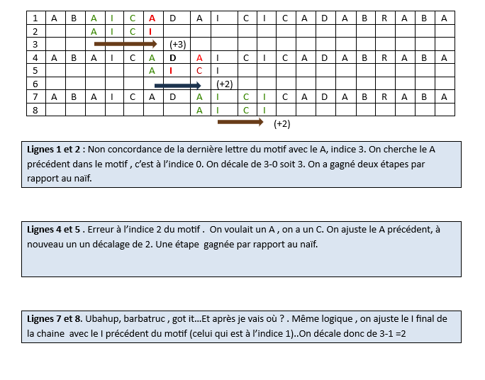
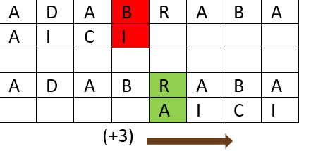
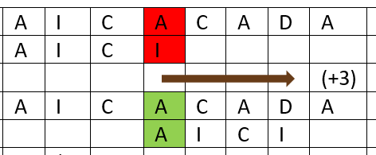
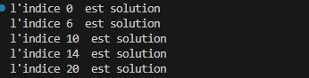

# Recherche Textuelle 


## 1. La problématique 

Ici, on va chercher une sous chaine de caractères dans une chaine plus grande . 
Les applications de cette recherche sont multiples mais une des plus importante est appliquée à la bioinformatique .


On va chercher une sous chaine dans un brin d'ADN


Par exemple, nous voulons rechercher la chaine **ACG** dans la chaine CAAGCGCACAAGACGCGGCAGACCTTCGTTATAGGCGATGATTTCGAACCTACTAGTGGGTCTCTTAGGCCGAGCGGTTCCGAGAGATAGTGAAAGATGGCTGGGCTGTGAAGGGAAGGAGTCGTGAAAGCGCGAACACGAGTGTGCGCAAGCGCAGCGCCTTAGTATGCTCCAGTGTAGAAGCTCCGGCGTCCCGTCTAACCGTACGCTGTCCCCGGTACATGGAGCTAATAGGCTTTACTGCCCAATATGACCCCGCGCCGCGACAAAACAATAACAGTTTGCTGTATGTTCCATGGTGGCCAATCCGTCTCTTTTCGACAGC**ACG**GCCAATTCTCCTAGGAAGCCAGCTCAATTTCAACGAAGTCGGCTGTTGAACAGCGAGGTATGGCGTCGGTGGCTCTATTAGTGGTGAGCGAATTGAAATTCGGTGGCCTTACTTGTACCACAGCGATCCCTTCCCACCATTCTTATGCGTCGTCTGTTACCTGGCTTGGCAT

>Pas de doute, il va falloir un peu de méthode, même si naturellement on a une idée simple...
## 2. L'algorithme naïf

!!! note   "Un peu bourrin mais"
 
       Intuitivement, on va placer le motif (sous chaine) au début de la chaine. On compare les premières lettres . Si elles sont égales , on passe à la lettre suivante , sinon , on décale le motif en le plaçant sous la deuxième lettre et ainsi de suite; ça marche .
    


#### L'algorithme naïf en python
``` python 
def rechercheNaïve(mot, motif):
    """ Recherche d'un motif dans une chaine de caractères
    entrées : Deux chaines de caractères, type str
    sorties : Une liste contenant les index où se trouve le motif
    """
    n= len(mot)
    t= len (motif)
    res =[]
    for i in range (n-t+1):
        j = 0
        while j<t and mot[i+j]==motif[j]:
            j= j+1
        if j == t:
            res.append(i)
    return res
assert(rechercheNaïve('cgtatagtata', 'ta') ==[2,4,7,9])
assert(rechercheNaïve('cgtatagtata', 'zzzzz') ==[])
```

!!! hint "Testons !"

    Testons le fonctionnement de cet algorithme 
         
    [lien](https://boyer-moore.codekodo.net)


## 3. L'algorithme de Boyer Moore Horspool

Le coût de l'algorithme précédent peut vite croitre. il est de l'ordre au maximum de (n-t+1)*t soit quadratique. Pour l'améliorer, l'idée va être de ne pas tester toutes les positions tout en étant sur de n'en oublier aucune.
 
!!! example  "Exemple d'amélioration"
    Voici  un façon d'améliorer cet algorithme 
    
                       
!!! hint   "Les deux idées qui font progresser la recherche :"
      
    <b>Idée N 1</b>
          
    1.Ici, on remarque que l’alignement se fait à part de 
        la dernière lettre. 
        En fait, on compare d’abord la dernière lettre   du motif. 
    Si elle ne correspond pas , pas la peine de regarder les autres.
    Il nous suffit alors de considérer les deux cas suivants :
         
    <b>Cas 1 </b>
         
         
         La dernière lettre ne correspond pas  : 
         On cherche un éventuel B en partant de la droite 
         dans le motif pour aligner .
          Il n'y en a pas , on décale le motif pour 
          le placer sous la première lettre après B
    <b>Cas 2</b>
        
          La derniere lettre ne correspond pas . 
          On va chercher un A dans le motif  et on le trouve . 
          On vient aligner ce A sous celui du mot. Le décalage est de 3.
     

     <b>   idee N2. </b>
        
     La deuxième idée est de prétraiter ces sauts . Le mieux est de partir d'un exemple  
    > On choisit le motif <b> ACTCAGGT</b>
      

    

      
    |  | A | C| G|T|                               
    |---------|-------------|---|----|---|
    |  0   | |  |
    | 1|   0 |    |
    |  2  |  0 |1 ||2
    | 3 |  0| 1  ||2
    | 4| 4 | 3  ||2
    | 5 | 4 |   3|5|2
    | 6 |  4|   3|6|2
    | 7|  4|  3 |6|7
    | 8 |  8|3   |6|7
!!! note "Le code du prétraitement"
    ``` python
     def table(m) : #m est le motif à traiter
            d=[{} for i in range (len(m))]
            for j in range (len(m)):
                for k in range(j):
                    d[j][m[k]]  = k
            return d 
    ```
!!!note "Le décalage et son dictionnaire "
    On va utiliser ce code pour établir la table de décalage . d est la table obtenue précédemment, c est le caractère obtenu à l'indice j du motif.
         
    !!!success  "Le code décalage"
         
        ``` py
         def decalage(d, j,c):
              if c in d[j]:
                 return j-d[j][c]  # il y a une clé 'c'à l'indice j
              else:
                 return j+1  # la lettre c n'est pas 
                    #présente à gauche dans le motif,
                     # on se met en j+1
 
  
        ```

!!! done " L'algorithme de Boyer Moore "
    * On crée la table de décalage
    * On parcourt le mot en plaçant la première lettre du motif sous la première lettre du mot
    * On s'arretera à l'indice len(mot) -len(motif)
    * On compare à partir de la droite

    ``` python
       def BM (motif, mot):
          d = table(motif)
          i = 0
          while i <= len(mot)-len(motif):
              k = 0
              for j in range (len(motif)-1 ,-1,-1):
                   if mot[i+j] != motif[j]:
                        k = decalage(d,j,mot[i+j])
                        break
              if k  == 0 :
                  print("l'indice",i," est solution")
              k = 1
              i += k
     ```
!!! done "Le script global"    

``` python


    def table(m) : #m est le motif à traiter
         d=[{} for i in range (len(m))]
         for j in range (len(m)):
             for k in range(j):
                d[j][m[k]]  = k
     return d 

    def decalage(d, j,c):
         if c in d[j]:
             return j-d[j][c]  # il y a une clé 'c'à l'indice j
         else:
             return j+1  # la lettre c n'est pas 
                    #présente à gauche dans le motif,
                     # on se met en j+1

    def BM (motif, mot):
      d = table(motif)
      i = 0
      while i <= len(mot)-len(motif):
          k = 0
          for j in range (len(motif)-1 ,-1,-1):
              if mot[i+j] != motif[j]:
                  k = decalage(d,j,mot[i+j])
                  break
          if k  == 0 :
              print("l'indice",i," est solution")
              k = 1
          i += k

    BM('gta','gtagatgtaggtaggtattagta')
```




=== "python"
     print('hello')

=== "js"
     console.log('test')

